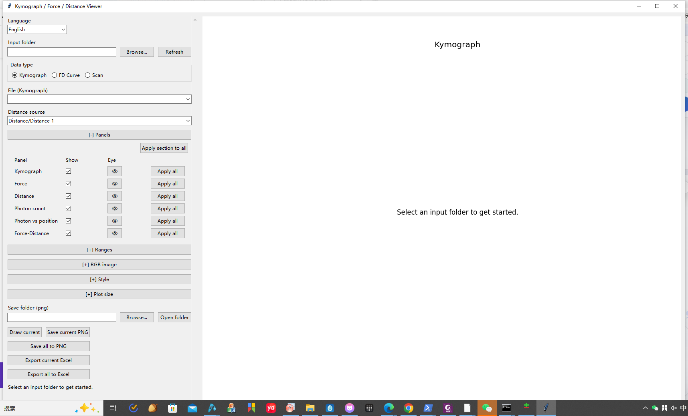
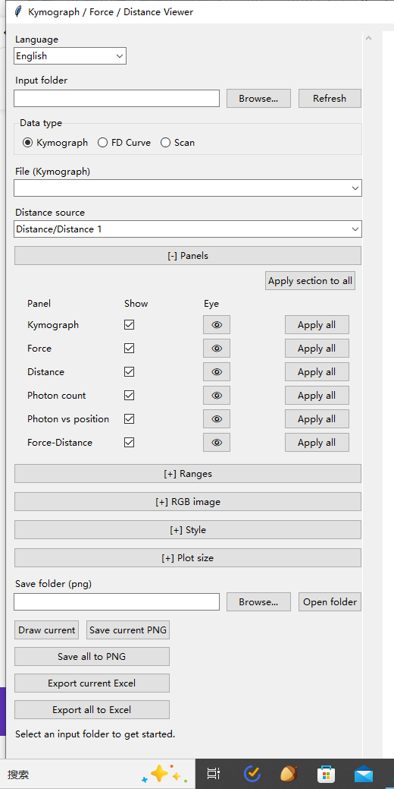
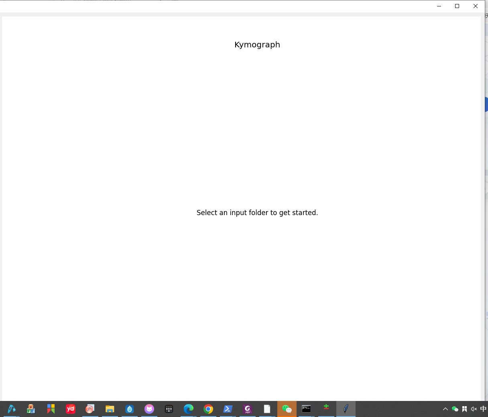

# OTPlotViewer

**OTPlotViewer** is a custom Python desktop tool for visualizing and exporting single-molecule optical tweezers data from Lumicks C-Trap `.h5` files.

**OTPlotViewer** 是一个用于 Lumicks C-Trap `.h5` 文件的单分子光镊数据可视化与导出软件。



## Features / 功能

- RGB kymograph visualization with adjustable channel ranges, gamma, and pseudocolors.
- Interactive box selection on kymographs for region-based analysis.
- Photon count versus time for selected kymograph regions.
- Photon count versus position for selected kymograph regions.
- Force, distance, and force-distance curve plotting.
- PNG export and Excel export.
- Windows folder-style distribution using PyInstaller.

中文功能概述：

- 显示 RGB kymograph，并支持调节各通道的最小值、最大值、gamma 和伪彩色。
- 支持在 kymograph 图上框选区域，用于区域统计。
- 对框选区域导出 photon count versus time。
- 对框选区域导出 photon count versus position。
- 支持 force、distance 和 force-distance 曲线绘制。
- 支持 PNG 和 Excel 导出。
- 支持用 PyInstaller 打包为 Windows 可分发文件夹版本。

## Interface / 界面

### Control Panel / 左侧控制区



The left panel is used to select an input folder, choose the data type, control displayed panels, adjust image/style settings, and export figures or tables.

左侧控制区用于选择输入文件夹、切换数据类型、控制显示面板、调节图像/样式参数，以及导出图片和表格。

### Preview Area / 右侧预览区



The right preview area displays the selected kymograph, traces, and analysis panels. In kymograph mode, users can drag a box on the image to update the selected time and image-position ranges.

右侧预览区显示所选 kymograph、曲线和分析面板。在 kymograph 模式下，可以直接在图像上拖拽框选区域，软件会自动更新所选时间范围和图像位置范围。

## Download And Install / 下载与安装

### Recommended: One-Click Windows Installer / 推荐：Windows 一键安装器

Go to the latest release page:

`https://github.com/Dorlores199/OTPlotViewer/releases`

Download:

`OTPlotViewer_Setup_1.0.2.exe`

Double-click the installer. It will download the packaged OTPlotViewer application from GitHub, install it into the current user's local application folder, and create Desktop and Start Menu shortcuts. No Python, conda, or manual environment configuration is required.

打开最新 release 页面：

`https://github.com/Dorlores199/OTPlotViewer/releases`

下载：

`OTPlotViewer_Setup_1.0.2.exe`

双击运行安装器。安装器会自动从 GitHub 下载 OTPlotViewer 应用包，安装到当前用户本地程序目录，并创建桌面和开始菜单快捷方式。用户不需要安装 Python、conda，也不需要手动配置环境。

### Portable Version / 便携版

If the one-click installer cannot download files automatically, download all split archive files from the release page:

- `OTPlotViewer_v1.0.2_windows_folder_split.7z.001`
- `OTPlotViewer_v1.0.2_windows_folder_split.7z.002`
- `OTPlotViewer_v1.0.2_windows_folder_split.7z.003`
- `OTPlotViewer_v1.0.2_windows_folder_split.7z.004`

Put all four files in the same folder, then open/extract `.001` with 7-Zip. After extraction, run `OTPlotViewer.exe` inside the `OTPlotViewer` folder.

如果一键安装器无法自动下载文件，可以从 release 页面手动下载所有分卷文件：

- `OTPlotViewer_v1.0.2_windows_folder_split.7z.001`
- `OTPlotViewer_v1.0.2_windows_folder_split.7z.002`
- `OTPlotViewer_v1.0.2_windows_folder_split.7z.003`
- `OTPlotViewer_v1.0.2_windows_folder_split.7z.004`

把四个文件放在同一个文件夹中，然后用 7-Zip 解压 `.001` 文件。解压后进入 `OTPlotViewer` 文件夹，双击运行 `OTPlotViewer.exe`。

## Basic Usage / 基本使用方法

1. Open `OTPlotViewer.exe`.
2. Click **Browse...** next to **Input folder** and select a folder containing `.h5` files.
3. Choose the data type: **Kymograph**, **FD Curve**, or **Scan**.
4. Select a file from the file dropdown.
5. In **Panels**, choose which panels to display and export.
6. In **RGB image**, adjust red/green/blue channel settings if needed.
7. In kymograph mode, drag a box on the kymograph to analyze a region.
8. Use **Save current PNG**, **Save all to PNG**, **Export current Excel**, or **Export all to Excel** to export results.

中文步骤：

1. 打开 `OTPlotViewer.exe`。
2. 在 **Input folder** 旁点击 **Browse...**，选择包含 `.h5` 文件的文件夹。
3. 选择数据类型：**Kymograph**、**FD Curve** 或 **Scan**。
4. 从文件下拉框中选择需要分析的文件。
5. 在 **Panels** 中勾选需要显示和导出的面板。
6. 如有需要，在 **RGB image** 中调节红、绿、蓝通道参数。
7. 在 kymograph 模式下，直接在图像上拖拽框选需要统计的区域。
8. 使用 **Save current PNG**、**Save all to PNG**、**Export current Excel** 或 **Export all to Excel** 导出结果。

## Dependencies / 依赖

The software was developed and tested with Python packages listed in `requirements.txt`:

- `lumicks.pylake`
- `h5py`
- `numpy`
- `pandas`
- `matplotlib`
- `openpyxl`

In this version, `lumicks.pylake` is used through `lumicks.pylake.File` to open C-Trap `.h5` files and access kymograph objects. Specifically, the software uses:

- `lk.File(h5_path)`
- `file_handle.kymos`
- `kymo.get_image("red")`
- `kymo.get_image("green")`
- `kymo.get_image("blue")`
- `kymo.line_timestamp_ranges()`
- `kymo.pixelsize_um`
- `kymo.line_time_seconds`
- `kymo.pixel_time_seconds`

Force and distance time-series datasets are read directly from the HDF5 file with `h5py`. Downstream image processing, photon-count calculations, plotting, and table export are performed with NumPy, Matplotlib, Pandas, and OpenPyXL.

本版本中，`lumicks.pylake` 主要通过 `lumicks.pylake.File` 打开 C-Trap `.h5` 文件，并读取 kymograph 对象及其图像/时间/像素尺寸信息。实际使用到的 Pylake 接口包括：

- `lk.File(h5_path)`
- `file_handle.kymos`
- `kymo.get_image("red")`
- `kymo.get_image("green")`
- `kymo.get_image("blue")`
- `kymo.line_timestamp_ranges()`
- `kymo.pixelsize_um`
- `kymo.line_time_seconds`
- `kymo.pixel_time_seconds`

Force 和 distance 时间序列则使用 `h5py` 直接从 HDF5 数据集中读取。后续图像处理、photon count 计算、绘图和表格导出由 NumPy、Matplotlib、Pandas 和 OpenPyXL 完成。

## Run From Source / 从源码运行

```powershell
python kymograph_force_distance_ui.py
```

## Build Windows Distribution / 打包 Windows 可分发版本

Install packaging dependencies:

```powershell
python -m pip install -r requirements-packaging.txt
```

Build the folder distribution:

```powershell
powershell -ExecutionPolicy Bypass -File .\build_windows.ps1 -PythonExe "C:\Path\To\python.exe"
```

The folder distribution is recommended for sharing because scientific Python applications often include native dependencies.

推荐使用文件夹版进行分发，因为科学计算 Python 程序通常包含较多原生依赖库，文件夹版比单文件版更稳定。

## Suggested Citation / 论文引用建议

Repository URL:

`https://github.com/Dorlores199/OTPlotViewer`

Version-specific release URL:

`https://github.com/Dorlores199/OTPlotViewer/releases/tag/v1.0.2`

仓库链接：

`https://github.com/Dorlores199/OTPlotViewer`

固定版本 release 链接：

`https://github.com/Dorlores199/OTPlotViewer/releases/tag/v1.0.2`

```text
Kymographs were processed and visualized using OTPlotViewer (v1.0.2; https://github.com/Dorlores199/OTPlotViewer/releases/tag/v1.0.2), a custom Python software package. The software uses lumicks.pylake.File to access C-Trap kymograph objects and metadata, including kymograph images, line timestamp ranges, pixel size, line time, and pixel time. Force and distance time series were read from HDF5 datasets using h5py. Downstream photon-count analysis, force-distance plotting, visualization, and data export were performed using NumPy, Matplotlib, Pandas, and OpenPyXL.
```

中文参考：

```text
Kymograph 数据使用自定义 Python 软件 OTPlotViewer (v1.0.2; https://github.com/Dorlores199/OTPlotViewer/releases/tag/v1.0.2) 进行处理和可视化。该软件使用 lumicks.pylake.File 读取 C-Trap kymograph 对象及其元数据，包括 kymograph 图像、line timestamp ranges、pixel size、line time 和 pixel time。Force 和 distance 时间序列使用 h5py 从 HDF5 数据集中读取。后续 photon-count 分析、force-distance 绘图、可视化和数据导出使用 NumPy、Matplotlib、Pandas 和 OpenPyXL 完成。
```

## License / 许可

No license file is included in this archived version. Add a license before public redistribution if required by your publication or institution.

当前归档版本尚未包含许可证文件。如需公开长期分发，建议根据文章或单位要求补充许可证。

